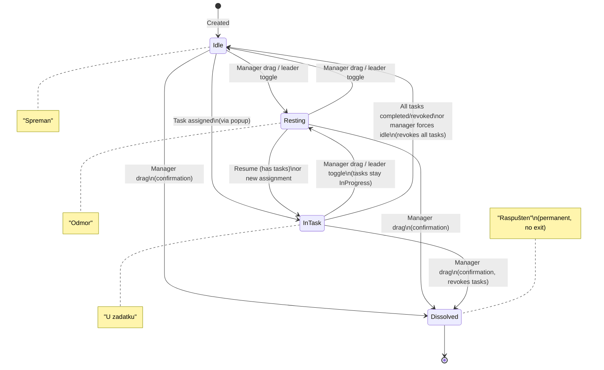

# CMRS Team Planner — System Design Spec

A field tool for the Croatian Mountain Rescue Service (HGSS) that simplifies forming search teams and coordinating tasks during search and rescue missions.

> **Note:** "Mission" is referred to as "Akcija" in the Croatian UI throughout the app.

## Technology Stack

| Layer | Technology |
|-------|-----------|
| Searcher app | Flutter (iOS + Android) |
| Manager app | Flutter (Windows desktop + iOS/Android + Web) |
| Backend API | C# / ASP.NET Core Minimal API |
| Hosting | Azure Container Apps (scale-to-zero) |
| Database | Azure SQL Serverless (auto-pause at idle) |
| Real-time | Azure SignalR Service (native .NET) |
| Auth | Microsoft Entra ID (Office 365) + anonymous token flow |
| AD sync | Microsoft Graph API |
| Localization | Croatian (primary), English (secondary), extensible via Flutter intl/ARB |

## Data Model

### Mission

- ID, name, description
- Status: Active / Suspended / Closed
- Station: inherited from the creating user's station attribute
- Join code (for QR and deep links)
- Created date, created by
- On suspend → resume: manager chooses to keep or dissolve teams
- Can be permanently deleted (with confirmation) when Suspended or Closed

### Operational Period (Operacijski Period)

- ID, Mission ID, name
- Locked: boolean (default false)
- A mission can have multiple operational periods simultaneously
- Each period has its own set of teams, tasks, and assignments
- Manager selects which period they are currently viewing/managing
- Locked periods are invisible to the searcher app and searchers cannot join them
- Manager app sees all periods (locked and unlocked)
- Purpose: divide a mission into work cycles (e.g., day shifts, phases)

### User

- Two types in one table:
  - **Registered**: Entra ID object ID, email, name, phone, AD attributes (station/unit, rank, qualifications — synced via Graph API on mission join, cached)
  - **Anonymous**: name, email only (no auth link)
- A user can be a member of multiple missions simultaneously

### MissionParticipant

- User ID, Mission ID
- Role: Searcher / Manager
- Joined at timestamp
- Left at timestamp (nullable — null means still active)

### PeriodParticipant (Check-in/Check-out)

- User ID, Period ID
- Checked in at: timestamp (when user checked into this period)
- Checked out at: timestamp (nullable — null means still checked in)
- Users check in/out of operational periods independently of mission membership
- A user can be checked into multiple periods simultaneously
- Managers can check users in/out
- The period participant list shows who's currently checked in with timestamps

### Team

- ID, Operational Period ID (links to mission through period)
- Name: optional — defaults to team leader's display name. Manager can rename teams at any time.
- Status: Resting / Idle / In Task / Dissolved
- Created by
- Join code (for QR and deep links)
- Dissolved teams remain with Dissolved status for historical record. Once dissolved, a team cannot be reinstated.
- Manager can create empty teams (first participant assigned becomes team leader)
- A team can be assigned multiple tasks simultaneously

### TeamMember

- Team ID, User ID
- Role: Leader / Member
- Active: boolean (false = historical member, kept for record)
- Exactly one active Leader per team (enforced by app logic)
- Joined at timestamp
- If the leader leaves the team: leadership transfers to the longest-serving remaining active member. If no active members remain, team is dissolved.
- Any team member (including the leader) can voluntarily leave a team (returns to Mission Lobby as unassigned)
- Team leader can dissolve their own team
- When a participant is removed from a mission, they are removed from active teams but remain in dissolved teams for historical record
- Inactive (historical) members are preserved for record — no timestamps needed for history

### Task

- ID, Operational Period ID (links to mission through period)
- Label: sector number or free-text description
- Search type: enum (Hasty, Grid, Road Patrol, etc. — extensible)
- Task type: enum (Ground/Pješaci, K9, UAV, Police) — categorizes by resource type
- Priority: High / Medium / Low
- Notes: free text
- Status: Draft ("U pripremi") / Unassigned / In Progress / Completed
- Assigned team: nullable FK to Team (multiple tasks can reference the same team)
- Started at: timestamp (set when moved to In Progress, nullable)
- Completed at: timestamp (set when moved to Completed, nullable)
- Tasks are editable after creation (label, search type, task type, priority, notes)

### Entity Relationships

```
Mission 1──* OperationalPeriod 1──* Team 1──* TeamMember *──1 User
Mission 1──* OperationalPeriod 1──* Task *──1 Team (nullable)
Mission 1──* OperationalPeriod 1──* PeriodParticipant *──1 User
Mission 1──* MissionParticipant *──1 User
```

## Operational Period Mechanics

An operational period is a work cycle within a mission. It scopes teams and tasks, allowing the manager to organize work into phases (e.g., Day 1, Day 2, Night shift).

**Manager perspective:**
- Manager creates/names operational periods within a mission
- Manager selects which period to view in the dashboard (period selector in UI)
- Manager sees all periods including locked ones
- Manager can lock/unlock periods
- Kanban boards show teams and tasks for the selected period only

**Searcher perspective:**
- Searchers join/leave missions only — no manual period check-in/out
- After joining a mission, searchers see teams from all unlocked periods (grouped by period if multiple)
- Check-in happens automatically when a searcher joins or creates a team (PeriodParticipant created)
- Check-out happens when: manager clicks "check out" for the user, or the period is locked
- If pre-assigned to a team by manager, searcher is auto-checked-in to the correct period
- Anonymous searcher joins via team QR code — automatically checked in to the correct period
- Locked periods and their teams are not visible to searchers

**Data isolation:**
- Teams belong to a specific period
- Tasks belong to a specific period
- A team from Period 1 cannot be assigned a task from Period 2
- MissionParticipant exists at the mission level (join/leave mission)
- PeriodParticipant exists at the period level (check-in/check-out with timestamps)

## Operations Control Model

One manager holds "operations control" of a mission at a time. Protocol-based, not enforcement-heavy. Control applies across all operational periods.

**Controller can**: assign teams to tasks, change task status, change team status, manage mission lifecycle, manage operational periods, dissolve teams, rename teams, delete missions, all CRUD operations.

**Non-controlling managers can**: view everything in real-time, add notes to tasks, create tasks in Draft status.

**Takeover**: any registered SAR manager can take control via a confirmation dialog. No approval from current controller needed. No auto-release on inactivity.

**Access**: only registered HGSS users (Entra ID) can access the manager app. Future: AD attribute to restrict to SAR manager role.

**Offline edge case**: if offline controller's queued changes conflict with new controller's changes, show them on reconnect for manual review/discard.

## Team Status Transitions

| Transition | Manager (controller) | Team Leader (searcher app) |
|------------|---------------------|---------------------------|
| Idle → Resting | Drag on kanban | Toggle in app |
| Resting → Idle | Drag on kanban | Toggle in app |
| Idle → In Task | Via task assignment (drag to column shows popup) | — |
| In Task → Resting | Drag on kanban | Toggle in app (pauses, tasks stay In Progress) |
| Resting → In Task | Drag on kanban (resumes if has tasks, popup if not) | Toggle in app (resumes) |
| In Task → Idle | All tasks completed/revoked, or manager forces | Mark last task as Completed ("Zadatak izvršen") |
| Any (except Dissolved) → Dissolved | Drag on kanban (confirmation dialog) | Dissolve button in app |
| Dissolved → Any | **Not allowed** — dissolved is permanent | — |

### Task State Diagram

```mermaid
stateDiagram-v2
    [*] --> Draft : Created

    Draft --> Unassigned : Manager promotes
    Unassigned --> Draft : Manager demotes

    Unassigned --> InProgress : Manager assigns team\n(sets startedAt)
    InProgress --> Unassigned : Manager revokes / drags back\n(releases team)
    InProgress --> Draft : Manager drags back\n(releases team)

    InProgress --> Completed : Manager or team leader\ncompletes (sets completedAt)

    state Draft {
        direction LR
    }

    note right of Draft : "U pripremi"
    note right of Unassigned : "Nedodijeljeno"
    note right of InProgress : "U tijeku"
    note right of Completed : "Završeno"
```

### Team State Diagram



### Multi-Task Team Behavior

A team can have multiple tasks assigned simultaneously. The team status follows these rules:

- **In Task**: team has at least one task In Progress
- **Completing one task**: if other tasks remain In Progress, team stays In Task. If all tasks are completed/unassigned, team transitions to Idle.
- **Resting**: team pauses. All assigned tasks stay In Progress. Resuming returns team to In Task.
- **Forced to Idle by manager**: all In Progress tasks are revoked back to Unassigned. Clean break.
- **Dissolved**: all In Progress tasks revoked to Unassigned. Team members become inactive (historical).

**Task revocation**: manager unassigns a team from a task. Task returns to Unassigned. If team has no remaining tasks, team goes to Idle.

**Moving task backward** (In Progress → Unassigned or Draft): releases team from that task. If team has no remaining tasks, team goes to Idle.

## Searcher App Flow

### 1. Welcome Screen

Two paths:
- "Sign in with HGSS account" (Entra ID / Office 365)
- "Continue without account" (enter name + email)

### 2. Post-Login Routing

- **Registered user pre-assigned to a team** → straight to Team View (auto-placed in correct mission + period)
- **Registered user pre-assigned to a mission (no team)** → Period Selection → Mission Lobby
- **Registered user with no assignment** → My Missions list (if any) + Active Missions List
- **Anonymous user** → message: "Scan a QR code or open a link to join a mission or team" + paste link field

### 3. My Missions + Active Missions List

- "My Missions" section at top: missions the user has already joined (tap to view)
- Active Missions List below (registered users only): all active missions they haven't joined yet
- Tap to join — user can be in multiple missions simultaneously
- Scan QR / open link / paste link option also available
- Missions the user has already joined do not appear in the join list

### 4. Mission Lobby (in mission, no team yet)

- Shows teams from all unlocked operational periods, grouped by period name if multiple exist
- "Waiting for team assignment" message
- Scan team QR / open team link / paste team link to join a team (team links only inside a mission)
- "Create a team" button → if multiple unlocked periods, picker shown; user becomes team leader
- Compact header bar: back arrow, mission name (truncated), overflow menu (⋮) with "Leave mission"
- Joining or creating a team automatically checks the user into that period (PeriodParticipant created)

### 5. Team View (main screen)

Layout order (top to bottom):
1. Team name (or leader's name if unnamed) + status badge
2. Operational period name shown
3. QR code display button + join link with copy button
4. Team leader status toggle (Resting ↔ Idle/In Task)
5. Team members list with names and phone numbers (tap to call), leader indicated
6. Dissolve team button (leader only) + Leave team button (all members)
7. Current task(s) — list of assigned tasks with details (label, search type, task type, priority, notes). Each task has "Zadatak izvršen" button for the leader. Or "No task assigned" if none.
- All updates in real-time via SignalR

### 6. Team Leader Actions (in searcher app)

- Create team and generate QR/link
- Display/share team QR, link, and copy link to clipboard
- Toggle team status: Resting ↔ Idle, Resting ↔ In Task (resume)
- Mark individual tasks as Completed ("Zadatak izvršen") → if no remaining In Progress tasks, team transitions to Idle
- Dissolve own team (with confirmation)
- Leave team (leadership transfers)

### 7. Mission Ended

- Summary screen when manager closes mission
- "Back to mission list" button to navigate away

### 8. Leave Mission

- Searcher can leave a mission at any time
- Leaving removes them from active teams (leadership transfers, empty teams dissolve)
- Members remain in dissolved teams for historical record
- Manager can also remove a participant from a mission (same behavior)
- Left at timestamp recorded on MissionParticipant

### QR / Deep Link Handling

- Mission QR/link → joins mission (then select period)
- Team QR/link → joins team + mission + period in one step
- Deep link scheme: `cmrs://mission/{code}` and `cmrs://team/{code}`
- Links displayed with copy button alongside QR codes (both manager and searcher)
- Searcher app supports pasting links to join missions/teams (input field for manual entry)
- On the mission list screen: paste field accepts both mission and team links (label: "Pridruži se")
- Inside a mission (lobby): paste field accepts team links only — mission links are rejected with message
- Missions a user has left (leftAt set) reappear in the joinable mission list

## Manager App Flow

### 1. Login

Entra ID only. No anonymous access.

### 2. Mission List (home screen)

- All missions grouped by station name in a collapsible tree structure
- Station inherited from the creating user's station attribute
- Filter buttons: All, Active, Suspended, Closed
- "Create Mission" → name, description → generates mission QR + deep link
- Tap mission to open

### 3. Mission Dashboard

**Operational Period selector** at the top of the dashboard:
- Dropdown or tab bar showing all periods for this mission
- "+" button to create new period (name)
- Lock/unlock toggle per period
- Selected period determines what's shown on the kanban boards

Two kanban boards below, scoped to the selected period. Side-by-side on desktop, tabbed on mobile.

**Tasks Kanban — columns: U pripremi | Unassigned | In Progress | Completed**

- Cards show: label, search type, task type badge, priority badge, assigned team, notes preview, edit link, timestamps (started/completed if set)
- Controller drag-and-drop:
  - Draft → Unassigned: direct drag
  - Unassigned → In Progress: drag → popup to select a team. Assigns team, sets team to In Task (if not already).
  - In Progress → Completed: drag. If team has no remaining In Progress tasks, team transitions to Idle. Completed at timestamp recorded.
  - In Progress → Unassigned/Draft: drag. Releases team from this task. If team has no remaining tasks, team goes to Idle.
- Tap edit link on card to edit task details (label, search type, task type, priority, notes)
- Non-controllers: add cards to Draft only, add notes
- Kanban columns expand to fill available screen width
- **Filtering**: filter tasks by label text search or task type (Ground, K9, UAV, Police)

**Teams Kanban — columns: Resting | Idle | In Task | Dissolved**

- Cards show: team name/leader name, member count, member names, assigned task(s) (if In Task), rename link, assign task link
- Controller actions:
  - Drag between Resting ↔ Idle (if team has tasks and moved to Idle → all tasks revoked)
  - Drag to In Task: if team has active task assignments → resumes; if no assignments → shows task assignment popup
  - "Assign Task" button → popup to select an Unassigned task → task moves to In Progress, team to In Task (if not already)
  - "Rename" link → rename dialog
  - Drag to Dissolved → confirmation dialog. All tasks revoked.
  - Dissolved teams: shown as full cards, cannot be dragged — permanent state
- Tap card for full team details, members (active + historical) with AD attributes, phones
- "+ New team" button creates empty teams (first member assigned becomes leader)
- **Filtering**: search bar to filter teams by team name or team member name (first/last)
- Mission join link displayed alongside QR code with copy button

### 4. Participants Panel (sidebar on desktop, slide-out drawer on mobile)

- All mission participants: name, status (in team / unassigned), AD attributes for registered users
- Shows joined at / left at timestamps
- Manager can assign unassigned participants to teams via dropdown
- Manager can add registered HGSS users from AD directory ("Add to mission" button) — auto-joins them to mission
- Manager can remove non-manager participants from mission (✕ button with confirmation)
- Removing a participant: removes from active teams, preserves membership in dissolved teams, records left at timestamp
- Shows anonymous users who joined via QR

### 5. Mission Controls

- Control indicator: "You have control" / "Controller: [name]" + "Take control" button
- Mission QR code display / share link
- Operational period management (create, lock/unlock, rename)
- Suspend mission (option: keep teams or dissolve) — with confirmation
- Resume mission
- Close mission — with confirmation dialog
- Delete mission — available on Suspended/Closed missions, with confirmation. Permanently removes all mission data.

### 6. Team Creation by Manager

- Create team within the currently selected operational period
- Optionally name it
- First member assigned becomes team leader
- Add members from participant list
- Assign one or more tasks
- Generate team QR/link

### Desktop vs Mobile Layout

- **Windows desktop / web**: side-by-side kanban boards with expanding columns, participants panel as sidebar, period selector as tabs or dropdown
- **Mobile**: tabbed view — Tasks board, Teams board. Participants accessible via slide-out drawer. Period selector at top. Same functionality, adapted layout.

## Architecture

### System Overview

```
Azure Cloud:
  - Entra ID (auth)
  - Azure SignalR Service (real-time push)
  - Azure Container Apps → ASP.NET Core API
    - REST endpoints (missions, periods, teams, tasks, users)
    - SignalR hub (real-time events)
    - Microsoft Graph client (AD sync)
    - QR/deep link generation
  - Azure SQL Serverless (auto-pause at idle)

Clients:
  - Searcher App (Flutter, iOS/Android) — requires connectivity
  - Manager App (Flutter, Windows/iOS/Android/Web) — offline-capable
```

### Backend — Single Service, Three Concerns

1. **REST API**: CRUD for missions, operational periods, teams, tasks, users. JWT bearer auth (Entra ID tokens) + lightweight anonymous session tokens. Versioned endpoints.

2. **SignalR Hub**: clients subscribe to mission-scoped groups. Pushes events for all state changes. Searcher apps receive, manager app sends and receives.

3. **Microsoft Graph Client**: fetches AD profile attributes on registered user mission join. Server-side only, cached in User record.

### Authentication

- **Registered users**: Entra ID / Office 365 login. Backend validates JWT tokens via Microsoft.Identity.Web.
- **Anonymous users**: submit name + email, backend issues a lightweight JWT (containing anonymous user ID and mission scope, no Entra ID claims). No Entra ID link.

### Real-time Events (SignalR)

All connected clients subscribe to a SignalR group scoped to their mission.

| Event | Triggered by |
|-------|-------------|
| PeriodCreated | Manager creates operational period |
| PeriodUpdated | Manager locks/unlocks/renames period |
| TeamCreated | Manager or searcher creates team |
| TeamUpdated | Status change, name change, dissolved |
| TeamMemberJoined | Someone joins a team |
| TeamMemberLeft | Someone leaves or gets reassigned |
| TaskCreated | Manager creates task |
| TaskUpdated | Status change, assignment, priority change |
| MissionStatusChanged | Manager suspends/resumes/closes |
| MissionDeleted | Manager deletes mission |
| ControlChanged | Manager takes control |
| ParticipantJoined | Searcher joins mission |
| ParticipantLeft | Searcher leaves or is removed from mission |

### Offline Support (Manager App Only)

- Local SQLite database via Drift mirrors mission state
- When offline: manager reads/writes to local DB, changes queued in sync table
- On reconnect:
  - If still in control: replay queue against API
  - If someone else took control: show queued changes for review/discard
- Receive missed events via SignalR catch-up or "sync since timestamp" REST endpoint
- Searcher app requires connectivity — no local DB

### Connection Lifecycle

- Searcher app: connects on mission join, disconnects on app close
- Manager app: connects on mission open, queues changes if offline, reconnects with exponential backoff (built into SignalR .NET client)

## Sub-project Decomposition

### Sub-project 0: Interactive Web Mockup — COMPLETE

React web app deployed to GitHub Pages for stakeholder validation.
Deployed at: https://daliborkusic.github.io/sar-operations-planner/

> Note: mockup does not yet reflect operational periods, multi-task assignment, task types, or filtering. These features are designed for the Flutter implementation.

### Side-quest: Tauri Manager App

Standalone manager-only desktop app (`manager-app-tauri/`) with local SQLite persistence. Does NOT replace the main Flutter plan. Available as Windows .exe and Linux AppImage.

> Note: Tauri app also does not yet reflect operational periods, multi-task, task types, or filtering.

### Sub-project 1: Backend API + Data Model

- ASP.NET Core Minimal API project
- Entity Framework Core + Azure SQL schema (including operational periods, multi-task, task types, timestamps)
- Entra ID authentication + anonymous token flow
- REST endpoints for all entities including operational periods
- SignalR hub with mission-scoped groups
- Microsoft Graph integration for AD attributes
- QR code / deep link generation
- Operations control mechanism

### Sub-project 2: Searcher Mobile App (Flutter)

- Flutter project setup with localization (hr/en)
- Entra ID login + anonymous entry
- Multi-mission support with mission list navigation
- Operational period selection (unlocked periods only)
- Mission join flow (list, QR scan, deep link)
- Leave mission flow (with left_at timestamp)
- Team view with multiple task display
- Team leader actions (create team, QR, mark individual tasks complete, toggle status, dissolve, leave)
- SignalR client for real-time updates

### Sub-project 3: Manager App (Flutter)

- Shared codebase with searcher app, role-based navigation
- Mission CRUD + lifecycle + delete
- Mission list grouped by station with collapsible tree
- Operational period management (create, lock/unlock, rename, select)
- Two kanban boards scoped to selected period, with drag-and-drop + assignment popups + expanding columns
- Multi-task assignment per team (assign popup allows selecting from unassigned tasks)
- Task type attribute (Ground, K9, UAV, Police)
- Kanban filtering: tasks by label/type, teams by name/member
- Responsive: tabs on mobile, side-by-side on desktop
- Task editing (label, search type, task type, priority, notes) with timestamps display
- Team rename, create empty teams, view historical members
- Participants panel with AD attributes, add/remove participants, joined/left timestamps
- Participants as slide-out drawer on mobile
- Operations control mechanism
- Team/task CRUD and assignment flows
- Offline support (Drift, sync queue, conflict handling)
- Platform builds: Windows desktop, mobile, web

### Build Order

0. Interactive Mockup → stakeholder validation, UX sign-off ✅
1. Backend API → after UX validated
2. Searcher App → validates API end-to-end
3. Manager App → most complex, builds on proven API + shared Flutter code

### Future: CalTopo Integration

- Import task/sector assignments from CalTopo
- Data model designed to accommodate this without rebuild
- Separate sub-project when needed
